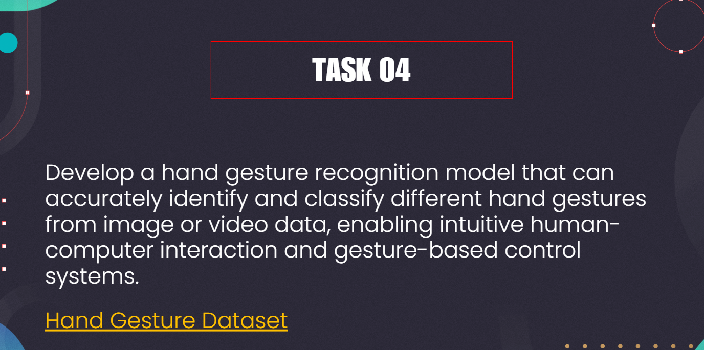
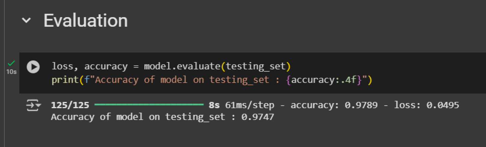
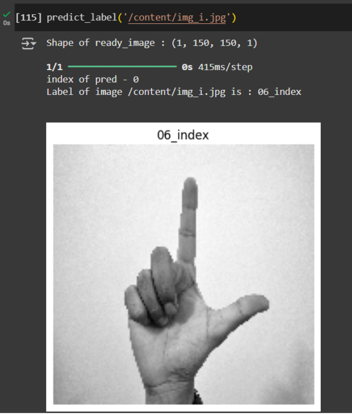
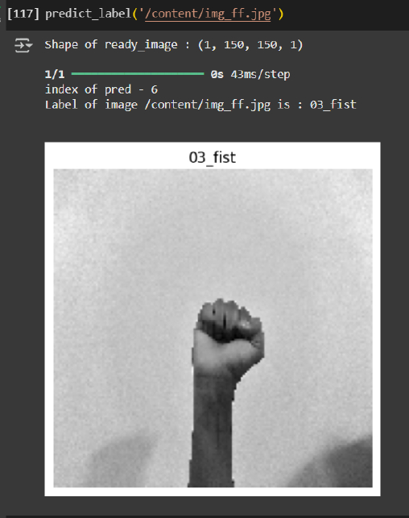

# Hand Gesture Classification using CNN



## 📌 Overview

This project focuses on building a **Convolutional Neural Network (CNN)** model for classifying **hand gesture images**. 
The model is trained on a Kaggle dataset, preprocessed and augmented for better generalization, and achieves an accuracy of **97.4%**.

The implementation is done in **Google Colab** using a **T4 GPU** for faster training.

---

## ⚙️ Tech Stack

* **Platform**: Google Colab (T4 GPU)
* **Programming Language**: Python
* **Libraries Used**:

  * `os` – Directory handling
  * `shutil` – Splitting data into train/test folders
  * `matplotlib` – Data visualization
  * `tensorflow` / `keras` – Deep learning framework
  * `pandas` – Data handling
  * `numpy` – Numerical operations

---

## 📂 Workflow

### 1. Data Loading

* Dataset imported using **`kagglehub_dataset`**.
* Directory structure verified before preprocessing.

### 2. Train-Test Split

* Used **`shutil`** to copy subdirectories into **`train/`** and **`test/`** folders.

### 3. Data Augmentation & Preprocessing

* Used **`ImageDataGenerator`** for:

  * Rescaling pixel values
  * Augmentations (rotation, flipping, zoom, etc.)
* Loaded images using **`flow_from_directory`**, which also handles automatic labeling.

### 4. Model Architecture (CNN)

* Built a **Convolutional Neural Network (CNN)** using Keras Sequential API.
* Model parameters: **10,637,514 trainable parameters**.
* Layers included convolution, max pooling, dropout, and fully connected layers.

### 5. Training & Evaluation

* Training carried out on Colab with **T4 GPU** acceleration.
* Achieved **97.4% accuracy** on the test set.

---

## 📊 Results

* **Training Accuracy**: \~97.4%
* **Validation Accuracy**: Comparable to training, indicating minimal overfitting.
* Model successfully distinguishes different hand gestures.







---

## 🚀 How to Run

1. Clone the repository (if applicable)

   ```bash
   git clone https://github.com/your-username/hand-gesture-classification.git
   cd hand-gesture-classification
   ```

2. Open in **Google Colab** and enable GPU (T4).

3. Install dependencies:

   ```bash
   pip install tensorflow keras pandas numpy matplotlib
   ```

4. Load dataset via Kaggle:

   ```python
   from kagglehub_dataset import KaggleDataset
   ```

5. Run the notebook end-to-end.

---

## 📌 Future Improvements

* Experiment with **transfer learning** (e.g., ResNet, EfficientNet).
* Hyperparameter tuning for further accuracy improvements.
* Deploy model as a **web app** using Flask/Streamlit.

---

## 🏆 Achievements

* Built a CNN with **10.6M trainable parameters**.
* Achieved **97.4% accuracy** in hand gesture classification.

---
